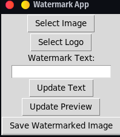

# Watermark App

The Watermark App is a Python application that allows you to add watermarks to images. You can choose an image, specify a watermark text, and optionally add a logo to the image. The app provides a preview of the watermarked image and allows you to save the modified image with the watermark.

1. Clone the repository:
```bash
git clone https://github.com/j-breedlove/watermarking_desktop_app.git
cd watermarking_desktop_app
```
## Features

- Select an image: Browse and choose an image file from your local system.
- Select a logo: Browse and choose a logo image file to add as a watermark.
- Watermark text: Enter the desired text for the watermark.
- Update preview: Generate a preview of the watermarked image based on the selected image, watermark text, and logo.
- Save watermarked image: Save the watermarked image with the applied watermark and logo to a desired location on your system.

## Prerequisites

- Python 3.x
- PIL (Python Imaging Library)
- Tkinter

## Installation

1. Clone the repository:

   ```bash
   git clone https://github.com/your_username/watermark-app.git
   ```

2. Change to the project directory:

   ```bash
   cd watermark-app
   ```

3. Install the required dependencies:

   ```bash
   pip install Pillow
   ```

## Usage

1. Run the script in a Python environment:

   ```bash
   python watermark_app.py
   ```

2. The Watermark App window will appear.
3. Click on the "Select Image" button to choose an image file.
4. Click on the "Select Logo" button to choose a logo image file (optional).
5. Enter the desired text for the watermark in the "Watermark Text" field.
6. Click on the "Update Text" button to apply the entered watermark text.
7. The preview of the watermarked image will be displayed in a separate window.
8. Click on the "Update Preview" button to generate a preview of the watermarked image.
9. Adjust the watermark text and logo as needed.
10. Once satisfied with the preview, click on the "Save Watermarked Image" button to save the modified image with the watermark to a desired location.
11. Choose the save location and provide a filename for the watermarked image.
12. The watermarked image will be saved successfully, and a confirmation message will be displayed.

## License

This project is licensed under the [MIT License](LICENSE).

## Acknowledgements

The Watermark App utilizes the following libraries:

- PIL (Python Imaging Library) - https://python-pillow.org/
- Tkinter - Python's standard GUI package

## Contributing

Contributions are welcome! If you have any ideas, suggestions, or improvements, please open an issue or a pull request.

## Contact

For any questions or inquiries, please contact [your_email@example.com].

Happy watermarking!
